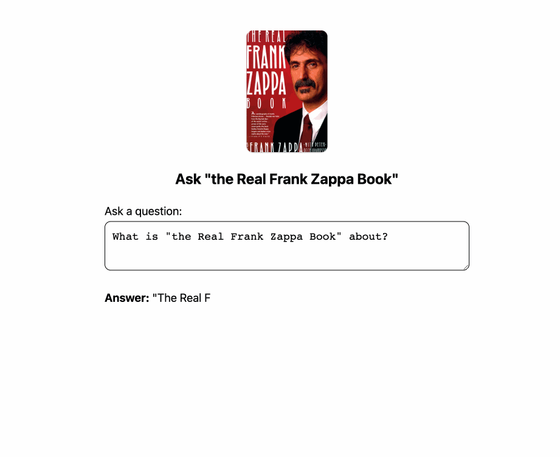

# Ask "the Real Frank Zappa Book"

a [Gumroad product engineering challenge][challenge-docs] project
which ports [askmybook][askmybook] to Ruby and swaps out the book.

# running this locally

run `make run`.

## dependencies

* ruby
* postgres
* nodejs
* an OpenAI API key

# running tests

run `make test`.

# notes

* **why _not_ "Pride & Prejudice"?** after I'd gotten the app running
  locally, the answers it returned seemed to be of uncannily high
  quality. I wondered whether OpenAI might have been trained on "Pride
  & Prejudice". While the jury's out, there's good reason to think
  that this might be the case; in any case, [I'm not the first to ask
  this question][yahoo-news]. I opted to choose another book so that
  might project might have less to do with how OpenAI was trained.

* **why "Pride & Prejudice?** I would've liked to pick a book with
  less narrative and more point of view, but I couldn't think of a
  freely available book that would qualify. I opted for "Pride &
  Prejudice" somewhat arbitrarily, but figured its length approximated
  "the Minimalist Entrepreneur" better than something shorter or
  something longer. "Pride & Prejudice" also has the benefit of being
  a stock English class book, so questions and answers about the book
  are easily found.

# explanation

>Explain a couple of the big architectural decisions you've made, and
>anything you learned/would do differently the next time around

## architectural decisions

* this is a Rails project, and does not intentionally deviate from any
  Rails project conventions. likewise, I chose to use a library to
  help me integrate React into this project. working with these
  conventions rather than against them let me focus on what the app
  does and how it does it. I chose PostgreSQL because it too is a
  sensible default that's well supported by Rails and Heroku.

* the `Answer` module, which does the heavy lifting of querying
  OpenAI, is not a class. I don't think that there'd be anything to
  gain by defining a constructor, getters and setters; the module and
  functions provide sufficient organization. within it, I chose to
  make the network requests more visible, at the top-level
  `answer_question` function. the idea is to lay out the function like
  this:
  
  * network IO
  * functional code
  * network IO
  
  the functional code is dependent on the reuslt of the network IO, so
  I think that this order makes sense - it's linear.
  
  this module is meant to keep this rather involved code out of the
  `QuestionsController`, in the interest of separating concerns. the
  controller stays in charge of request input and generating the
  response, but much of what happens in between has been factored
  out. `QuestionsController#create` could be made smaller still, but I
  think it reads well enough as is.
  
* the `Question` class does nothing other than what ActiveModel
  provides. I'd rather keep business logic out of Rails objects. 
  
* the Ruby side of the project closely follows the model of the Python
  code. it was straightforward to port the business logic of the
  Python to Ruby basically line for line. Django and Rails parallel
  each other, but hardly in a line-for-line way.
  
  the HTML is meant to very closely approximate the source HTML. the
  main benefit of it this is that it allowed me to copy the CSS
  verbatim and use all of that styling for free.
  
  the JavaScript side does lean on the source code, but my approach
  wasn't to try to port it line-by-line. I let React, and my knowledge
  of the desired behavior, guide my work, rather than focus on porting
  the source JS bit by bit.

## things learned

### OpenAI

I learned about OpenAI, period. I had no experience with it in any
form, by choice. working on this project has helped me to develop my
point of view on OpenAI.

it was strange to discover that OpenAI's "Pride and Prejudice" answers
were too good, and to then consider why that might be. because OpenAI
is a black box full of information, it seemed (and still seems) hard
to gauge how good my completion prompt is. I can imagine giving OpenAI
a totally useless prompt which it could totally ignore in favor of
what it already knows.

because it's hard to gauge the efficacy of a prompt and context when
OpenAI might just know too much about the topic, it might be
interesting to flip this challenge on its head and construct prompts
with the intent of distortion OpenAI's answers - this kind of approach
might say more about the influence of the prompt on the completion
result.

othrewise, I think that the essence of this project would be best
expressed with obscure content that OpenAI hasn't been trained on.

## things I would do different next time around

I'd definitely push more on my React skills. there are a number of
finer points of React components that I'd like to explore more
deeply. for example, I feel that my use of the `questionIdRef` is
hacky, as are my recursive `showAnswer` calls - they seem like they
might not be idiomatic React. my JS and CSS isn't processed beyond the
defaults of the libraries I used - they could certainly be minified,
at least. I would be interested to try `react_on_rails` and see how it
compares to `react-rails`.

I would try write the Ruby port of the Python code to be less of a
line-for-line port. doing it line-for-line was a pragmatic choice that
helped me to implement the code and learn about it at the same time. I
think that the code could be pared down more to its essence by not
feeling obligated to port it line-for-line.

[challenge-docs]: https://gumroad.notion.site/Product-engineering-challenge-f7aa85150edd41eeb3537aae4632619f
[askmybook]: https://github.com/slavingia/askmybook
[yahoo-news]: https://news.yahoo.com/top-50-books-being-used-100200591.html
